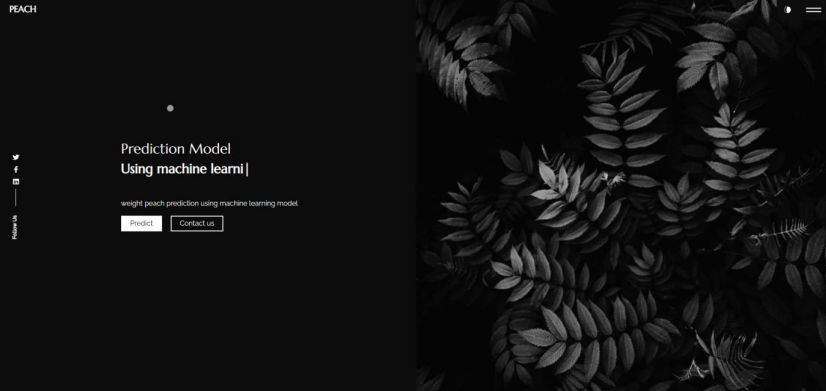

# Using Machine Learning to Predict the Harvest of the Peche Tree

Accurate prediction of Peach fruit weight is essential for optimizing yield management and quality control in the fruit industry. This study aims to develop a robust predictive model for
estimating Peach fruit weight using machine learning techniques. Four machine learning models,
including Support Vector Regression (SVR), Linear Regression, XGBoost, and Random Forest,
are employed to assess their effectiveness in predicting Peach fruit weight based on various input
parameters. The dataset used in this study comprises measurements of architectural parameters of
Peach fruit trees, specifically the" Saisonnier", and "Precoce" varieties, located in the Sefrou region.
The architectural parameters include the length and circumference of different tree structures,
such as the trunk, frames, underframes, and mixed branches.

## Data:
- The data was collected from farms all around the region of Meknes, this process involved many farmers and engineers who made sure to deliver the data as precisely as possible.
- The data was collected in the span of 3 years; for the 3 varieties; "saisonnier", "precoce" and "tardive".
              

- The picture below shows the structure of a tree as it is being referred to in the dataset. the naming conventions used here are traditionally used in the agricultural sector.
We've decided to use the same naming convention.
              

## PreProcessing:
Among many steps in the preprocessing procedure, we've analyzed and  dealt with the missing values, the picture below demonstrates the number of missing values 
there was in some of the input columns.

## Models:
- We've used a variety of regression models; the best results were obtained with Linear Regression, SVR, and XGBOOST.
- We've implemented a Grid Search for all the models to get the best model with the pipeline associated.

## APP:
-To locally test the models, we've created a web app using Django and React:

-The user can fill a form and get the prediction:

